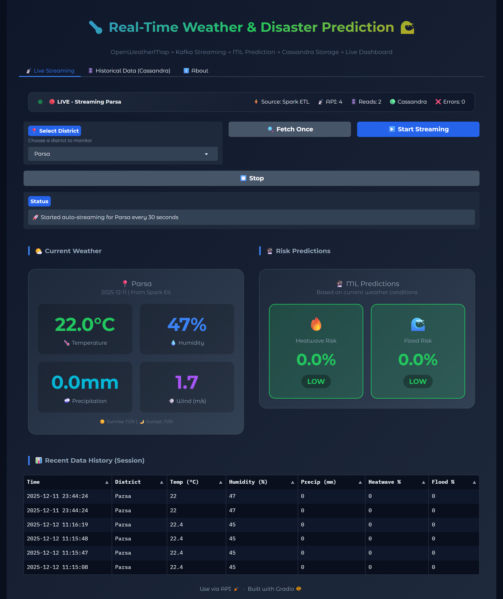
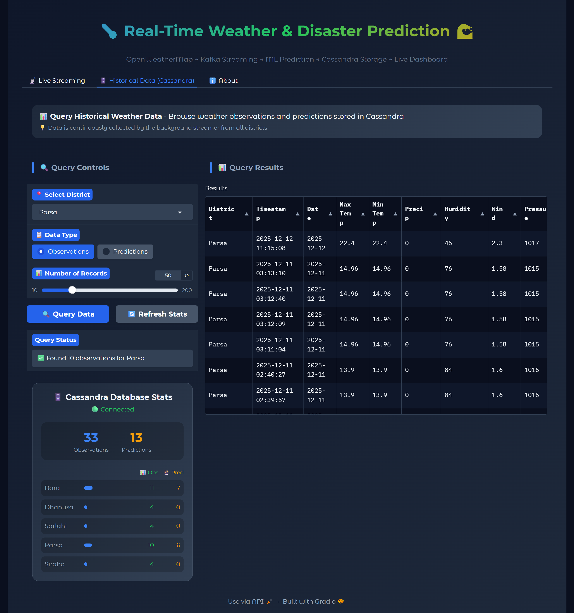
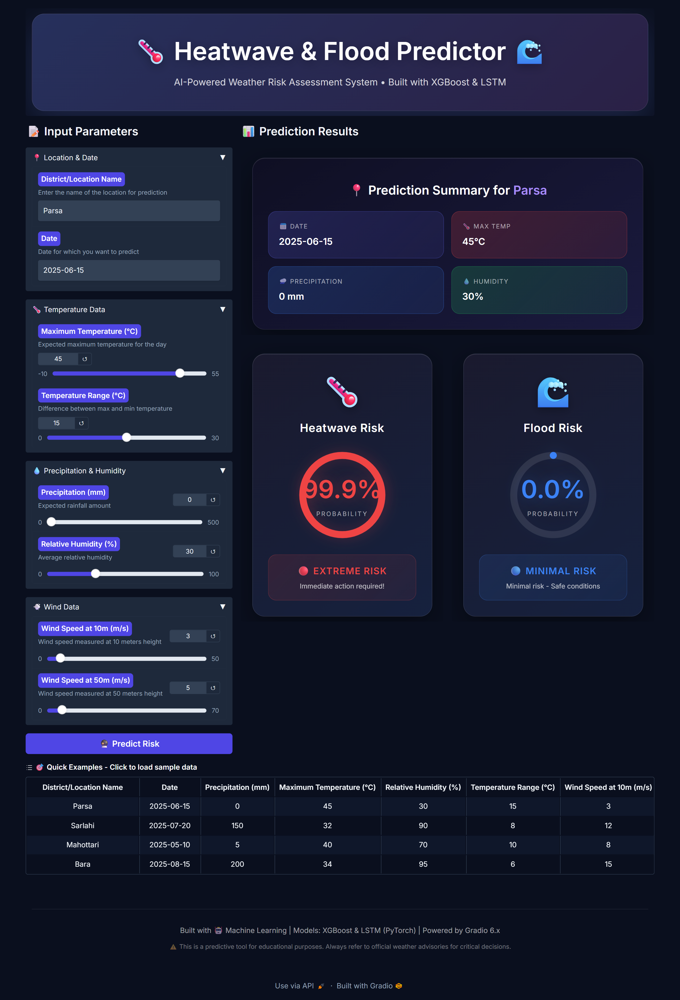
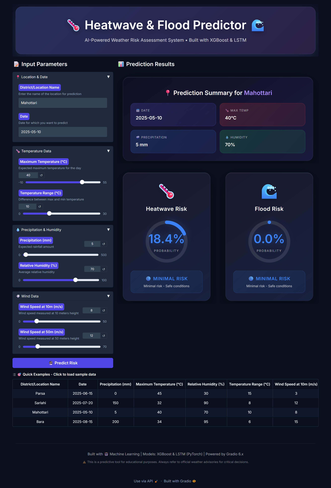

# Heatwave & Flood Prediction Pipeline

A Big Data pipeline implementing **Lambda Architecture** for real-time weather monitoring and disaster risk prediction using Apache Kafka, Hadoop HDFS, Spark, and Cassandra.

## Architecture (Lambda Architecture)


### Component Roles (Lambda Architecture)

| Layer | Component | Role | Why Required |
|-------|-----------|------|--------------|
| **Ingestion** | **Kafka** | Message queue / buffer | Decouples producers from consumers, handles backpressure, enables replay |
| **Processing** | **Spark** | Distributed stream/batch processing | Scalable ETL, complex transformations, feature engineering |
| **Batch Layer** | **HDFS** | Distributed file system (Data Lake) | Stores raw data for batch reprocessing, immutable master dataset |
| **Speed Layer** | **Cassandra** | Distributed time-series storage | Low-latency queries, real-time views |
| **Serving** | **Dashboard** | Visualization | Merges batch and speed layer views |

### Why HDFS + Cassandra (Lambda)?

- **HDFS (Batch Layer)**: Stores ALL raw data for historical analysis and recomputation
- **Cassandra (Speed Layer)**: Provides real-time views with low latency
- **Combined**: Accuracy from batch + Speed from real-time = Best of both worlds

## Features
- **Lambda Architecture**: Batch + Speed layers for robust data processing
- **Kafka Ingestion**: Real-time message streaming with fault tolerance
- **HDFS Data Lake**: Persistent raw data storage for batch reprocessing
- **Spark Streaming**: Distributed stream processing from Kafka → HDFS + Cassandra
- **Spark Batch**: Reprocess historical data from HDFS → Cassandra
- **ML Predictions**: XGBoost models for heatwave and flood risk
- **Real-time Dashboard**: Gradio app reading from Cassandra
- **Cassandra Storage**: Time-series data persistence

---

## Prediction Examples

### Weather Dashboard - Live Predictions



### Cassandra Data View



### Heatwave & Flood Risk Predictions





---

## Quick Start (Full Lambda Architecture)

### 1. Setup Environment

```powershell
python -m venv venv
.\venv\Scripts\Activate.ps1
pip install -r requirements.txt
```

### 2. Set OpenWeatherMap API Key

```powershell
setx OPENWEATHERMAP_API_KEY "your_api_key_here"
# Restart PowerShell after this
```

### 3. Start Infrastructure (HDFS + Kafka + Cassandra)

```powershell
docker-compose up -d

# Wait for HDFS NameNode to be ready (~30 seconds)
# Check: http://localhost:9870 (HDFS NameNode UI)
```

### 4. Start Kafka Producer (Terminal 1)

```powershell
# Fetches weather from OpenWeatherMap → Publishes to Kafka
python kafka_producer_api.py
```

### 5. Start Spark Streaming Consumer (Terminal 2)

```powershell
# Consumes from Kafka → Writes to HDFS (batch) + Cassandra (speed)
python spark_etl_pipeline.py --mode stream-kafka --interval 10
```

### 6. Send Weather Data to Kafka (Terminal 3)

```powershell
# Trigger weather fetch for all Nepal districts
Invoke-RestMethod -Uri "http://localhost:8000/weather/nepal" -Method GET
```

### 7. Start Dashboard (Terminal 4)

```powershell
python weather_dashboard.py
# Open http://localhost:7860
```

---

## HDFS Data Lake Operations

### Check HDFS Status

```powershell
# List all data in HDFS
python spark_etl_pipeline.py --mode list-hdfs
```

### Batch Reprocessing (Lambda Batch Layer)

```powershell
# Reprocess historical data from HDFS → Cassandra
python spark_etl_pipeline.py --mode batch-hdfs
```

### Web UIs

| Service | URL | Description |
|---------|-----|-------------|
| **HDFS NameNode** | http://localhost:9870 | File system browser, cluster status |
| **HDFS DataNode** | http://localhost:9864 | DataNode metrics |
| **Kafka UI** | http://localhost:8080 | Topic browser, messages |
| **Dashboard** | http://localhost:7860 | Weather monitoring |
| **Kafka Producer API** | http://localhost:8000/docs | OpenAPI documentation |

---

## Alternative: Direct Mode (No Kafka)

If you want to skip Kafka for simpler setup:

```powershell
# Direct: API → Spark → Cassandra
python spark_etl_pipeline.py --mode stream --interval 10
```

---

## Optional: Query Cassandra CLI

```powershell
# Show stats
python cassandra_query.py stats

# Query observations for a district
python cassandra_query.py observations --district Bara --limit 20

# Export to CSV
python cassandra_query.py export --district Bara --output bara_weather.csv
```

---

## Files of Interest

- `kafka_producer_api.py` — FastAPI producer that fetches weather from OpenWeatherMap and publishes to Kafka topic 'weather-data'.
- `spark_etl_pipeline.py` — Spark Structured Streaming consumer that reads from Kafka, transforms data, and writes to Cassandra.
- `weather_dashboard.py` — Gradio dashboard that reads processed data from Cassandra.
	- Live Streaming: Shows latest data from Cassandra (populated by Spark)
	- Historical Data: Query historical observations and predictions
- `cassandra_query.py` — CLI tool for ad-hoc queries, stats, and export from Cassandra.
- `spark_etl_pipeline.py` — Apache Spark-based ETL pipeline for batch processing weather data.
- `train_xgb.py`, `train_lstm.py`, `evaluate.py` — model training and evaluation scripts.

---

## Cassandra: notes & schema

The dashboard and background streamer create and use the keyspace `weather_monitoring` with tables:
- `weather_observations` — raw time-series observations (partitioned by district, clustered by fetch_time)
- `weather_predictions` — stored predictions per district
- `daily_weather_summary` — aggregate daily stats

If you ever lose the keyspace, re-run the dashboard or the background streamer to re-create schema.

---

## Spark ETL Pipeline

The `spark_etl_pipeline.py` provides Apache Spark-based Extract, Transform, Load (ETL) for batch processing:

### ETL Stages

1. **Extract**: Fetch weather data from OpenWeatherMap API for all monitored districts
2. **Transform**: PySpark transformations including:
   - Data cleaning & type casting
   - Temporal feature extraction (hour, day, month, season)
   - Derived metrics (temp range, pressure deviation, wind chill, heat index)
   - Risk indicator calculations (heat risk, flood risk scores)
   - Aggregations (hourly, daily summaries, alerts)
3. **Load**: Write transformed data to Cassandra or local files (CSV/Parquet)

### Usage

```powershell
# Run full ETL pipeline (extract → transform → load)
python spark_etl_pipeline.py --mode all

# Extract only (fetch from API)
python spark_etl_pipeline.py --mode extract

# Transform only (process existing data)
python spark_etl_pipeline.py --mode transform

# Load only (write to Cassandra)
python spark_etl_pipeline.py --mode load

# Continuous streaming ETL (runs every N minutes)
python spark_etl_pipeline.py --mode stream --interval 5
```

### Spark Session Configuration

The pipeline auto-configures Spark with:
- Cassandra connector (spark.jars.packages)
- Memory settings (2GB driver, 1GB executor)
- Cassandra connection (localhost:9042)

### Output Tables (Cassandra)

- `weather_transformed` — Transformed weather observations with derived features
- `weather_daily_summary` — Daily aggregated statistics per district
- `weather_alerts` — Generated alerts for high-risk conditions

---

## Running locally (summary)

1. Start Docker services:
```powershell
docker-compose up -d
```
2. Start background ingestion:
```powershell
python background_streamer.py --interval 30
```
3. Start dashboard:
```powershell
python weather_dashboard.py
```
4. Run ad-hoc queries:
```powershell
python cassandra_query.py observations --district Bara --limit 10
```

---

## Requirements

Key Python packages are listed in `requirements.txt`. Important ones used by the added components:
- `gradio` — Web dashboard UI
- `cassandra-driver` — Cassandra client
- `kafka-python` — Kafka client (producer/consumer)
- `requests` — HTTP requests to OpenWeatherMap and producer API
- `pyspark` — Apache Spark for ETL processing
- `xgboost`, `joblib` — ML models
- `pandas`, `numpy` — Data handling

Install all with:

```powershell
pip install -r requirements.txt
```

---

## Notes & Troubleshooting

- If the dashboard reports Cassandra not connected, ensure Docker Compose is running and the Cassandra container is healthy.
- If you see `NoBrokersAvailable` from Kafka, ensure Kafka & Zookeeper are up (`docker-compose ps`) and retry the producer/consumer.
- Background streamer requires a valid `OPENWEATHERMAP_API_KEY` environment variable.

If you'd like, I can also:
- Push a small example of how to visualize historical trends (plots) in the dashboard
- Add Docker Compose health-check automation to ensure Cassandra/Kafka restart on failures

---

## License

This project is provided for demonstration and research purposes.